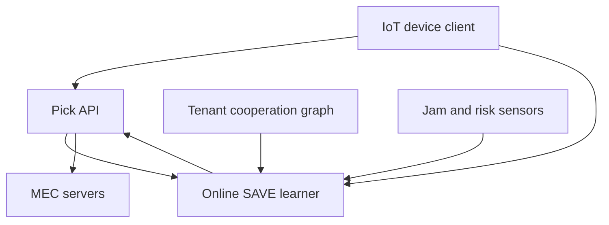

# HarborPick

**Source:** `ai-in-iot/1805.03591v1/`
**Domain:** `ai-iot`
**One-liner:** An online bandit that picks the least-jammed, lowest-security-risk edge server for each IoT offload — with optional peer side-observations — so devices keep computing under jamming without burning extra spectrum or power to “punch through.”
**Wedge:** Latency-sensitive IoT fleets (industrial AR/vision, smart-grid sensors, campus robotics) that already offload to multiple MEC servers and suffer intermittent RF jamming or untrusted edge nodes.
**Positioning:** Security-aware edge offload control plane. Distinct from ChoirEdge (LAN DNN sharding) and GhostLane (trajectory prediction under packet loss): HarborPick productizes SAVE-S/SAVE-A — stochastic and adversarial jamming-aware server selection with O(√T) regret guarantees and a quantified “value of cooperation” when devices share risk observations.

## Market research synthesis

### Thesis from source

Edge computing moves compute closer for latency-sensitive IoT, but introduces security problems: malicious or privacy-prying edge nodes, and physical-layer jamming that blocks device–server links. Classic jamming defenses spend extra spectrum or transmit power — scarce for low-power IoT. The paper reframes the problem as sequential server selection under unknown future jamming and security risk, using online learning (multi-armed bandit / online linear programming over server distributions).

SAVE-S addresses stochastic jamming; SAVE-A addresses adversarial jamming. Without prior knowledge of future risks, both achieve O(√T) regret. Devices may only access a subset of servers per slot; side-observation graphs capture which server risks become visible when peers share information. Smaller independence numbers on those graphs tighten regret — the formal “value of cooperation.” Randomized selection is preferred over deterministic policies that adversaries can reverse-engineer. Effectiveness is shown on synthetic and real datasets. The commercial wedge is a coordinator/SDK that continuously ranks MEC endpoints for offload under security and jam awareness, rather than static DNS or latency-only load balancers.

### Buyer & economic model

- **Primary buyer:** Head of Edge Platform / MEC operations at telco, campus, or industrial edge providers.
- **Users:** IoT application owners, edge SREs, security architects, device firmware teams.
- **Budget owner / value metric:** edge reliability and security budget. Value metrics: successful offloads under jam events, security-incident rate on chosen servers, regret vs oracle, energy not spent on jam-fighting power ramps.
- **Competing status quo:** latency-only load balancers; static server pins; spectrum/power jamming countermeasures; manual trust lists without online update.

### Domain constraints

- **Regulatory / trust / safety:** offloading sensitive telemetry to “more trusted” edges still needs data-minimization and contractual trust tiers; randomized selection must remain explainable to auditors at aggregate level.
- **Data sensitivity:** shared side-observations of security risk can leak operational intel between tenants — cooperation graphs need tenancy boundaries.
- **Change-management realities:** apps must call an offload picker API; servers must emit risk signals (attestation, anomaly, admin flags).

## Business requirements

- BR-1: For each offload request, the system must return a server distribution or sample biased toward historically reliable, low-risk, reachable servers under current jam evidence.
- BR-2: Modes for stochastic vs adversarial jam assumptions must be selectable per fleet policy (SAVE-S vs SAVE-A class behavior).
- BR-3: Cooperation via side-observations must be optional and tenant-scoped; enabling it must show measurable regret/performance lift (“value of cooperation”).
- BR-4: Selection must remain randomized enough to resist adversaries inferring deterministic strategies, while exposing aggregate explainability for operators.
- BR-5: Servers under active jam or security-risk spikes must be temporarily removed from feasible sets K_t.
- BR-6: Devices must report realized outcomes (success, latency, suspected jam, privacy incident flags) to close the learning loop.
- BR-7: Regret and success metrics vs baselines (latency-only, round-robin) must be reported continuously.
- BR-8: Fail-closed options must prefer local degrade/ defer over offloading to untrusted servers when all options are poor.
- BR-9: Trust-tier labels on servers (contractual) must bound exploration — some arms may be excluded regardless of short-term reward.
- BR-10: Multi-tenant isolation must prevent cross-tenant risk graphs unless explicitly federated.
- BR-11: Energy accounting must show avoided power/spectrum countermeasures when HarborPick reroutes instead of punching through.
- BR-12: Commercial packaging prices by managed devices and edge servers under optimization.

## User stories

Canonical user stories live in sibling [USER_STORIES.md](USER_STORIES.md).

## System design

### Overview

HarborPick maintains per-device (or per-fleet) online learners over edge servers. Feasible sets reflect reachability and jam sensors; rewards combine success, latency, and security-risk signals. Optional cooperation overlays share server-risk observations within a tenant graph. A control API returns sampling distributions; outcome reports update weights. Ops consoles expose regret, modes, and trust-tier constraints.

### Actors & boundaries

- **Actors:** devices, MEC servers, edge SRE, app owner, security architect, admin.
- **Trust boundary:** risk signals may be self-reported by servers — corroborate with independent probes; cooperation graphs stay inside tenant trust domains.
- **Human-in-the-loop points:** mode selection, trust-tier locks, federation of cooperation, fail-closed policy.

### Core capabilities

1. **Server registry and trust tiers**
2. **Feasible-set and jam sensing**
3. **SAVE-S / SAVE-A style online selection**
4. **Cooperation / side-observation graphs**
5. **Offload pick API**
6. **Outcome learning loop**
7. **Regret and energy reporting**
8. **Fail-closed degrade policies**

### Conceptual data

- **Primary entities:** Device, EdgeServer, TrustTier, FeasibleSet, PickDecision, Outcome, CooperationEdge, RegretReport, JamEvent.
- **Critical events:** jam detected, pick issued, outcome reported, tier locked, cooperation enabled, fail-closed engaged.
- **Retention / audit needs:** pick/outcome logs retained for security review windows; raw task payloads never stored by HarborPick.

### Integrations (conceptual)

- **Systems of record:** MEC orchestrator, device fleet manager, SIEM.
- **Upstream signals:** RF jam detectors, server attestation/security scores, latency probes.
- **Downstream actions:** offload routing, local degrade, SRE pages.

### High-level architecture

### Success metrics

- **Leading:** pick latency; feasible-set churn; cooperation participation; fail-closed rate.
- **Lagging:** offload success under jam; security incidents on selected servers; regret vs baselines; energy not spent on jam power ramps.

## OpenAPI skeleton

Canonical HTTP surface lives in sibling [openapi.yaml](openapi.yaml). Summary:

- **Base path:** `/v1/...`
- **Auth:** `X-API-Key` for devices; Bearer JWT for operators.
- **Resource groups:** Servers, Devices, Picks, Outcomes, Cooperation, Reports.
