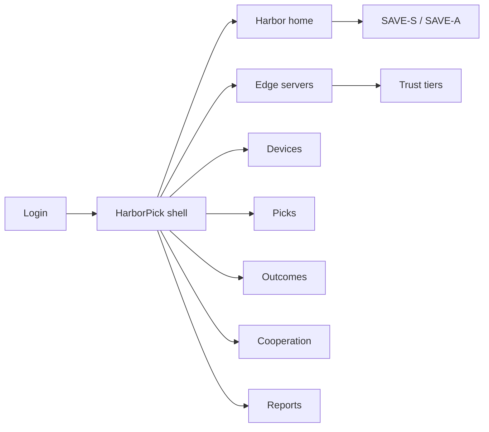
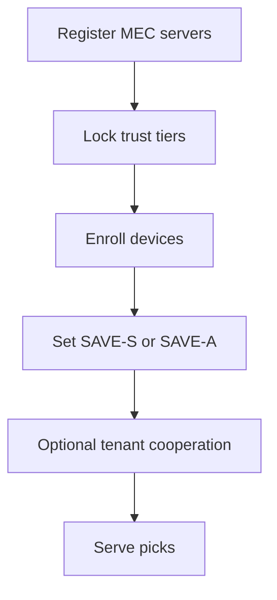
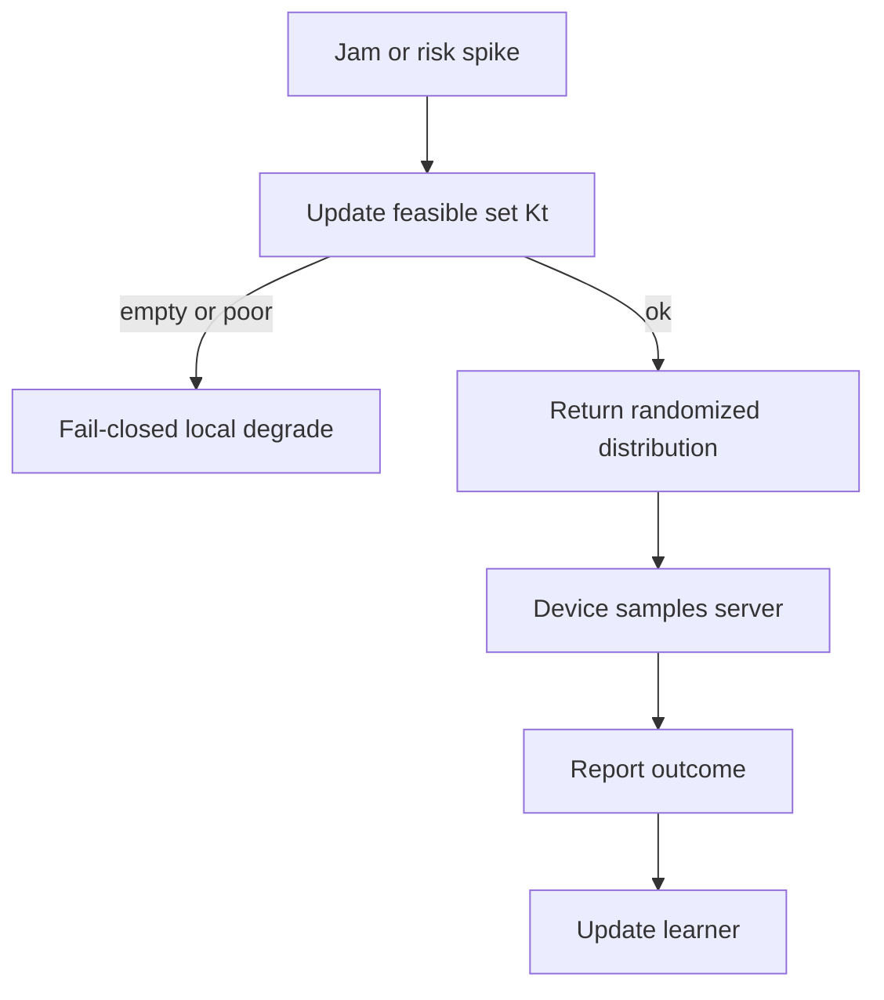

# HarborPick — Web app

**Product:** [PRODUCT.md](./PRODUCT.md)
**Primary surface:** MEC offload picker console (edge SRE + security under one HarborPick shell)
**Secondary surfaces:** Regret vs baseline report (read-only); energy-avoided jam-week report
**Design thesis:** HarborPick is a harbor master’s board for edge offload — the UI metaphor is choosing a safe berth under storm (jamming) and untrusted docks, not a latency-only load-balancer chart. Visual language is deep harbor navy with beacon-amber feasible arms and coral banned/trust-locked docks: a randomized pick feels like a deliberate cast of lots among safe berths; fail-closed local degrade feels like staying in port. The wordmark sits as a quiet beacon seal on every pick and trust-tier screen so operators know whose security-aware distribution they are sampling.

## UX research synthesis

### Category peers (best-in-class)

- **AWS IoT Greengrass / Azure IoT Edge ops:** Device-to-edge routing, offline degrade, and module placement. Steal: fail-closed local degrade when cloud/edge is unsafe (BR-8); reject pure availability routing without jam/security risk arms.
- **KubeEdge / OpenYurt dashboards:** Edge node registry, readiness, and workload targeting. Steal: server registry lifecycle with attestation metadata; reject Kubernetes-only chrome for MCU thin clients.
- **Cloudflare Load Balancing / NS1 Pulse:** Health-aware traffic steering with explainable reason codes. Steal: remove unhealthy targets from feasible sets with operator-visible reasons (BR-5); reject deterministic sticky policies adversaries can reverse-engineer (BR-4).
- **Telco MEC orchestrator UIs (e.g., HPE GreenLake edge / similar):** Multi-site edge inventory and SLA views. Steal: site-scoped SAVE-S vs SAVE-A mode; reject latency-only SLO as the sole optimizer.

### Patterns to adopt / reject

- **Adopt:** Randomized sampling from returned distributions; trust-tier hard exclusions; jam-driven feasible-set churn; optional tenant-scoped cooperation graphs with “value of cooperation” lift; regret vs latency-only/round-robin; outcome feedback loop; energy avoided vs punch-through; fail-closed degrade.
- **Reject:** Static server pins as default; cross-tenant risk graphs; purple AI glow; showing per-request secrets that defeat randomization; power-ramp jam fighting as the recommended fix; editable regret numbers.

### Trust, density, and workflow constraints from PRODUCT.md

Contractual trust tiers must bound exploration (BR-9). Cooperation optional and tenant-scoped (BR-3, BR-10). Aggregate explainability for auditors without exposing deterministic strategies (BR-4). Risk signals may be self-reported — corroborate with probes (system design). Payloads never stored by HarborPick. Stochastic vs adversarial modes selectable (BR-2).

## Information architecture

### Nav model

### Roles → default home

| Role | Default home | Why |
|------|--------------|-----|
| Edge SRE | Harbor home — regret & jam | Prove picker value (BR-7) |
| Security architect | Trust tiers + cooperation | Cap exploration / tenancy (BR-9, BR-10) |
| IoT application owner | Picks API monitor + fail-closed | Safe offload (BR-1, BR-8) |
| Device firmware engineer | Outcomes / client samples | Close learning loop (BR-6) |
| Platform administrator | Server registry | Arms enter/exit (BR-12) |

### Cross-links to OpenAPI resources

| Nav area | OpenAPI tags / resources |
|----------|---------------------------|
| MEC registry / tiers | Servers |
| Fleet clients | Devices |
| Offload distributions | Picks |
| Success / jam / privacy flags | Outcomes |
| Side-observation graphs | Cooperation |
| Regret and energy | Reports |

## Screen inventory

### Harbor home

- **Purpose:** Answer “are we berthing offloads safely under jam, and is regret beating latency-only?” in one composition.
- **Entry:** SRE default; deep link from jam events.
- **Layout regions:** Brand chrome; KPI strip (offload success under jam, regret vs baselines, fail-closed rate, energy avoided, cooperation lift); site mode badges (SAVE-S / SAVE-A); jam map of servers in/out of K_t; alerts rail.
- **Primary actions:** Open server; switch mode (policy-gated); open regret report.
- **Empty / loading / error:** Empty = register servers + enroll devices; error = retry with request id.
- **BR / story ties:** BR-2, BR-7, BR-11.

### Edge server registry

- **Purpose:** Register/retire MEC servers with attestation metadata and trust tiers.
- **Entry:** Servers nav; admin path.
- **Layout regions:** Server table (site, trust tier, attestation, jam state, risk score, in K_t?); detail with probe corroboration vs self-report; retire control.
- **Primary actions:** Register; lock tier; force remove from K_t; retire.
- **Empty / loading / error:** Attestation stale = amber; trust-locked never explorableshow coral lock.
- **BR / story ties:** BR-5, BR-9; administrator stories.

### Trust tier policy

- **Purpose:** Contractual bounds so the bandit cannot learn to use prohibited nodes.
- **Entry:** Servers → Tiers; security architect default secondary.
- **Layout regions:** Tier matrix (allowed exploration, data classes permitted); hard-exclude list; change audit.
- **Primary actions:** Edit tier rules; dual-control for lowering bars; export policy.
- **Empty / loading / error:** Conflicting tier vs jam remove explained in plain language.
- **BR / story ties:** BR-9; security architect stories.

### Devices and client enrollment

- **Purpose:** Fleet that samples from pick distributions; compact outcome reporters.
- **Entry:** Devices nav.
- **Layout regions:** Device table (site, mode inheritance, last pick, fail-closed engagements); SDK version; subset of reachable servers.
- **Primary actions:** Enroll; assign site policy; open pick history.
- **Empty / loading / error:** Hard-coded endpoint detected = migration nudge.
- **BR / story ties:** BR-1, BR-6; firmware engineer stories.

### Picks monitor

- **Purpose:** Inspect issued distributions/samples with aggregate explainability — not a reverse-engineerable sticky map.
- **Entry:** Picks nav; app owner path.
- **Layout regions:** Pick stream (device, feasible set size, sampled server, mode, reason codes aggregated); distribution histogram over window (not single-request recipe for adversaries); fail-closed events.
- **Primary actions:** Open related outcomes; export aggregate explainability pack.
- **Empty / loading / error:** All arms poor → fail-closed banner (BR-8).
- **BR / story ties:** BR-1, BR-4, BR-8.

### Outcomes inbox

- **Purpose:** Close the learning loop with success, latency, suspected jam, privacy-prying flags.
- **Entry:** Outcomes nav; from picks.
- **Layout regions:** Outcome table; privacy-flag highlight; jam suspicion vs probe corroboration; weight-update acknowledgment.
- **Primary actions:** Confirm probe; quarantine server arm; open SIEM link.
- **Empty / loading / error:** Missing outcomes = learning stall warning.
- **BR / story ties:** BR-6; security architect privacy-flag story.

### Cooperation graph

- **Purpose:** Optional tenant-scoped side-observations; show value-of-cooperation lift; block cross-tenant edges.
- **Entry:** Cooperation nav.
- **Layout regions:** Graph of devices/servers sharing risk observations; participation toggle; regret lift before/after; federation requests (explicit only).
- **Primary actions:** Enable within tenant; deny cross-tenant; measure lift.
- **Empty / loading / error:** Cross-tenant attempt = blocked with policy cite (BR-10).
- **BR / story ties:** BR-3, BR-10.

### SAVE mode and site policy

- **Purpose:** Select stochastic vs adversarial jam assumptions per fleet/site.
- **Entry:** Home → Modes; site settings.
- **Layout regions:** Mode cards with threat-model copy; active sites; change impact preview.
- **Primary actions:** Set SAVE-S / SAVE-A; schedule canary mode flip.
- **Empty / loading / error:** Mixed modes on one device = validation error.
- **BR / story ties:** BR-2; SRE mode story.

### Reports

- **Purpose:** Continuous regret vs latency-only and round-robin; energy not spent on jam power ramps.
- **Entry:** Reports nav; finance/admin secondary.
- **Layout regions:** Regret curves; success under jam; energy-avoided during jam weeks; baseline selectors.
- **Primary actions:** Export; pin to exec pack.
- **Empty / loading / error:** Insufficient horizon = “building regret estimate.”
- **BR / story ties:** BR-7, BR-11.

## Key flows

1. **Stand up picker for a site** — register servers + tiers → enroll devices → set SAVE mode → optional cooperation → monitor regret; failure: no attested servers or open trust tiers.

2. **Offload under jam** — jam sensor shrinks K_t → pick distribution over remaining trusted arms → device samples → outcome → update; if empty/poor → fail-closed local degrade (BR-5, BR-8).

3. **Trust-tier exclusion** — architect locks prohibited node → arm never explored regardless of short-term reward (BR-9).

4. **Enable cooperation** — tenant graph on → measure regret lift → keep or disable (BR-3).

5. **Jam-week energy report** — compare reroute vs hypothetical punch-through power (BR-11).

## Design system

### Tokens (CSS variables)

- `--color-ink: #E6EEF5` — primary text
- `--color-harbor-950: #061018` — app ground
- `--color-harbor-900: #0C1A24` — panels
- `--color-harbor-700: #2A4050` — rules
- `--color-beacon: #F0B429` — feasible / pick accent
- `--color-beacon-dim: #8A6A20` — beacon on dark
- `--color-sea: #3D9EBD` — success offload / cooperation lift
- `--color-coral: #E85D4C` — jam / banned tier / fail-closed
- `--color-steel: #7A9BB0` — secondary labels
- `--color-brand: #E8C56A` — HarborPick wordmark
- `--font-display: "Sora", sans-serif`
- `--font-mono: "IBM Plex Mono", monospace` — server ids, pick ids
- `--space-1`…`--space-8`: 4px scale
- `--radius-sm: 4px`; `--radius-md: 8px`
- `--motion-cast: 200ms ease-out` — distribution sample highlight
- `--motion-jam: 240ms ease-in-out` — coral remove from K_t
- `--motion-degrade: 280ms linear` — fail-closed banner
- Atmosphere: soft horizon gradient (navy→teal hush) without purple; abstract pier-line texture — no stock container-ship stock photos.

### Typography & brand

- Display for regret and success KPIs; mono for pick/outcome ids.
- Brand on picks and trust-tier views; login: “Berth the offload, don’t punch the jam.”

### Do / don’t

- **Do:** Randomize among safe arms; hard-lock trust tiers; show cooperation lift; fail-closed degrade; aggregate explainability.
- **Don’t:** Purple AI glow; sticky deterministic maps; cross-tenant graphs; recommend TX power ramps as primary fix; store task payloads.

### Accessibility & domain trust cues

- AA+ on beacon/coral/sea; banned servers labeled “Trust-locked.”
- Live regions for jam removals and fail-closed.
- Focus: servers/tiers → devices → picks → outcomes → cooperation → reports.

## Component patterns

- **FeasibleSetChip** — in/out of K_t with jam/risk reason.
- **TrustTierLock** — non-explorable contractual arm.
- **PickDistributionBars** — aggregate sampling histogram over a window.
- **FailClosedBanner** — local degrade when no acceptable server.
- **CooperationLiftStat** — regret improvement from side-observations.
- **SaveModeToggle** — SAVE-S vs SAVE-A per site.
- **OutcomeFlagRow** — success / jam / privacy-prying.
- **RegretVsBaseline** — vs latency-only and round-robin.
- **EnergyAvoidedStat** — jam-week reroute vs punch-through.

## Out of scope for v1 web

- Full MEC orchestrator / Kubernetes control plane; RF jammer geolocation product; application payload inspection; multi-cloud cost FinOps suite; consumer CDN portal; spectrum license filing tools.
